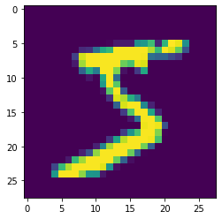
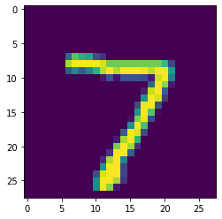

# The Problem

Artificial neural network has no magic. The main purpose of neural network (and any classical machine learning algorithm) is to find out `special numbers` in order to find out the best `classifier` or `regressor`.

Suppose we have the following data:

```
age height weight
50  170    75
40  180    ?
```

Now, we want to know the weight of someone whose age is `40`, and height is `180`.

This is a regression problem. Mathematically you can formulate the problem as follow:

$$weight = w1.age + w2.height + w3$$

Now our goal is to find out 3 magic numbers, `w1`, `w2`, and `w3`.

# A simple approach (Non-neural-network)

You might be tempted to solve the equation using pure `algebra`. Since we have single data with three variables (aka: the special numbers), we can't solve the equation with pure algebra.

So, let's solve the equation using brute-force experiments!!!

## Finding the regressor

First of all, we have to define our `loss function` (how far we are from the target). In our case, the loss function is as follow:

$$error = |actualWeight - predictedWeight|$$
$$error = |actualWeight - (w1.age + w2.height + w3)|$$

Let's implement the loss function in Python:


```python
def loss_function(actual_weight, w1, age, w2, height, w3):
    error = abs(actual_weight - (w1*age + w2*height + w3))
    return error
```

Now, let's try to assign `1`-`100` to `w1`, `w2`, and `w3` in order to get the best numbers for each of them


```python
age = 50.0
height = 170.0
actual_weight = 75.0
best_error = 0 # error threshold, we are only interested for error that is less or equal to 0
max_shown_solution = 5 # we just want to show 5 solutions
shown_solution = 0

for w1 in range(-101, 101):
    for w2 in range(-100, 101):
        for w3 in range(-100, 101):
            error = loss_function(actual_weight, w1, age, w2, height, w3)
            if error <= best_error and shown_solution < max_shown_solution:
                best_error = error
                shown_solution += 1
                print("error:", error, "w1:", w1, "w2:", w2, "w3:", w3)

```

    error: 0.0 w1: -101 w2: 30 w3: 25
    error: 0.0 w1: -100 w2: 30 w3: -25
    error: 0.0 w1: -99 w2: 29 w3: 95
    error: 0.0 w1: -99 w2: 30 w3: -75
    error: 0.0 w1: -98 w2: 29 w3: 45


Perfect, we have several predictors!!! 

Let's take the first one: `w1=-100`, `w2=30`, and `w3=-25`

For `age=50`, `height=170`, we get

$$predictionWeight = -100 . 50 + 30 . 170 - 25 . 1$$
$$predictionWeight = -5000 + 5100 - 25$$
$$predictionWeight = 75$$

The `prediction_weight` is equal to `actual_weight`!!!

## Using the regressor

Finally, for `age=40` and `weight=180`, we get this:

$$predictionWeight = -100.40 + 30.180 - 25.1$$
$$predictionWeight = -4000 + 5400 - 25$$
$$predictionWeight = 1375$$

Well, not so make sense, probably we need to use another available predictor.

__Note:__ If your problem can be perfectly solved with pure-algebra/brute-force. Just use them for your own good. Neural network or any other machine learning algorithm, should only be used if the solution is not obvious.

## What just happened?

We have just jump into a problem named `overfitting`. Overfitting is a problem where our predictor/regressor is correct for the training data, but incorrect for the testing data.

Technically, the problem with our approach are:

* overfitting
* we naively believe that w1, w2, and w3 are integer
* we naively believe that the predictor is a straight linear line. Probably we need some logarithm, power, and other eccentric operations in order to get the correct predictor/classifier
* we naively believe that we can try all possible solutions

Neural networks can only solve the three last problems.

Overfitting is still a common problem in machine learning. Unfortunately, the only way to deal with overfitting is by provide more `training data`.

# Neural Network approach

As already stated, neural network is no magic.

In our previous approach, the regressor is formulated as follow: 

$$weight = w1.age + w2.height + w3$$

Suppose we have a function `f` to process the result, the regressor should looks like this:

$$weight = f(w1.age + w2.height + w3)$$

This is what a single neuron in neural network do !!!


## Feed Forward

The process of feed forward is as simple as 

$$weight = f(w1.age + w2.height + w3)$$

Or, to make it more general we can write the equation as follow:

$$y = f(\Sigma^{n}_{i=1}w_ix_i)$$

For the sake of simplicity, we can break down the equation as follow:

$$y = f(net)$$

where

$$net = \Sigma^{n}_{i=1}w_ix_i$$1

We will use this later for back-propagation.

The `w`s are random numbers, while `f` can be any function. The most commonly used activation function are enlisted here: https://towardsdatascience.com/activation-functions-neural-networks-1cbd9f8d91d6

Suppose we have the following data:

```
x1 x2 target
0  1  0.3
1  0  0.7
```

and the following configuration:

```
w1 = 0.1
w2 = 0.2
w3 = 0.1
f = sigmoid
```

Since sigmoid function is described as follow:

$$f(x) = \frac{1}{1+e^x}$$

Then, we can calculate `y` as follow:

$$y = f(net) = \frac{1}{1+e^{net}}$$

where `net` is

$$net = \Sigma^{n}_{i=1}w_ix_i = w_1x_1 + w_2 x_2 + w_3$$

In some literature, you will find `b` (stand for bias) instead of `w3`. Don't worry, you can even think `w3` as `w3.x3` where `x3` is `1`.

Finally, for `x1=0`, `x2=1`, `target=0.3`, `w1 = 0.1`, `w2 = 0.2`, and `w3 = 0.1` we get this:

$$y = f(net)$$

and

$$net=w_1x_1 + w_2x_2 + w_3$$

thus

$$y = \frac{1}{1+e^{(0.1 x 0 + 0.2 x 1 + 0.1)}}$$

Calculating the equation give us:


```python
import math
y = 1/(1+math.exp(0.1 * 0 + 0.2 * 1 + 0.1))
y
```


    0.425557483188341


Comparing the `target` and `y`, we can find that the result is not so good. Our `target` is `0.3`, while `y` is `0.426`

To calculate the error we usually use this formula:

$$E(y) = \frac{1}{2}(target-y)^2$$

We need to square `target-y` to avoid negative number. While `1/2` is a math trick to make derivative of `E` easier to calculate.

## Back propagation

Back propagation is a process to adjust weight (w1, w2, and w3) in order to reduce the error.

If we think `x1`, `x2`, and `x3` as a vector. We will need at least two information to adjust `w1`, `w2`, and `w3`:

* how much should they change: we can set a `learning rate` for this purpose. Learning rate can be any number. The bigger the learning rate, the faster the learning process. However, it will prone to oscilation.
* to what direction: we do it by calculating `derivative`

To calculate the new value of `x1`, `x2`, and `x3` we can use these formulas:

$$\Delta w1 = -learningRate * \frac{dE}{df} * \frac{df}{dw1}$$
$$\Delta w2 = -learningRate * \frac{dE}{df} * \frac{df}{dw2}$$
$$\Delta w3 = -learningRate * \frac{dE}{df} * \frac{df}{dw3}$$


# Neural Network implementation using Tensorflow

TensorFlow is an open-source software library for dataflow programming across a range of tasks. It is a symbolic math library, and is also used for machine learning applications such as neural networks.

Unlike `sklearn.neural_network`, tensorflow give us more freedom to set up our neural-network.

First of all, let's try to import tensorflow and keras (which is now also part of tensorflow)

## Importing Tensorflow and Keras


```python
# TensorFlow and tf.keras
import tensorflow as tf
from tensorflow import keras

# Helper libraries
import numpy as np
import matplotlib.pyplot as plt
```

## Explore the dataset

We will try to perform classification task on mnist's dataset (http://yann.lecun.com/exdb/mnist/). The dataset contains of `70000` gray-scale images. Each image has `28 x 28` dimension and belong to one (and only one) of the following 10 classes:


```python
class_names = ['zero', 'one', 'two', 'three', 'four', 'five', 'six', 'seven', 'eight', 'nine']
```

Now, let's download `fashion_mnist` dataset from `keras.datasets` and split them into `train` and `test` set. By default, the dataset contains of `60000` training set and `10000` test set.


```python
mnist = keras.datasets.mnist

(train_images, train_labels), (test_images, test_labels) = mnist.load_data()

```

Let's explore the data a little bit

Here is a bit information about our `train_labels`. It is a one-dimension array with 60000 elements


```python
train_labels
```


    array([5, 0, 4, ..., 5, 6, 8], dtype=uint8)


```python
train_labels.shape
```


    (60000,)


Now, let's explore our `train_images`


```python
train_images
```


    array([[[0, 0, 0, ..., 0, 0, 0],
            [0, 0, 0, ..., 0, 0, 0],
            [0, 0, 0, ..., 0, 0, 0],
            ...,
            [0, 0, 0, ..., 0, 0, 0],
            [0, 0, 0, ..., 0, 0, 0],
            [0, 0, 0, ..., 0, 0, 0]],
    
           [[0, 0, 0, ..., 0, 0, 0],
            [0, 0, 0, ..., 0, 0, 0],
            [0, 0, 0, ..., 0, 0, 0],
            ...,
            [0, 0, 0, ..., 0, 0, 0],
            [0, 0, 0, ..., 0, 0, 0],
            [0, 0, 0, ..., 0, 0, 0]],
    
           [[0, 0, 0, ..., 0, 0, 0],
            [0, 0, 0, ..., 0, 0, 0],
            [0, 0, 0, ..., 0, 0, 0],
            ...,
            [0, 0, 0, ..., 0, 0, 0],
            [0, 0, 0, ..., 0, 0, 0],
            [0, 0, 0, ..., 0, 0, 0]],
    
           ...,
    
           [[0, 0, 0, ..., 0, 0, 0],
            [0, 0, 0, ..., 0, 0, 0],
            [0, 0, 0, ..., 0, 0, 0],
            ...,
            [0, 0, 0, ..., 0, 0, 0],
            [0, 0, 0, ..., 0, 0, 0],
            [0, 0, 0, ..., 0, 0, 0]],
    
           [[0, 0, 0, ..., 0, 0, 0],
            [0, 0, 0, ..., 0, 0, 0],
            [0, 0, 0, ..., 0, 0, 0],
            ...,
            [0, 0, 0, ..., 0, 0, 0],
            [0, 0, 0, ..., 0, 0, 0],
            [0, 0, 0, ..., 0, 0, 0]],
    
           [[0, 0, 0, ..., 0, 0, 0],
            [0, 0, 0, ..., 0, 0, 0],
            [0, 0, 0, ..., 0, 0, 0],
            ...,
            [0, 0, 0, ..., 0, 0, 0],
            [0, 0, 0, ..., 0, 0, 0],
            [0, 0, 0, ..., 0, 0, 0]]], dtype=uint8)


```python
train_images.shape
```


    (60000, 28, 28)


Just to make sure, let's see our first image and label in detail


```python
index = 0
label = train_labels[index]
image = train_images[index]

print("label: ", label) # this is the first train_labels
print("which is: ", class_names[label]) # use our pre-defined class_names to get textual representation of the label
plt.figure()
plt.imshow(image) # if you just want to see the matrix representation of the image, use `image` instead
plt.show()

```

    label:  5
    which is:  five





## Configuring the neural network model

Finally, let's build our neural network.

First of all, we define 3 layers here:

* flatten layer with input_shape = 28x28: This one will transform our 2 dimensional matrix into 1 dimensional matrix (or a vector). The output of this layer will be an array with 784 elements
* dense layer containing 1024 neuron with sigmoid activation: This one will create a layer containing 128 neuron. Each of them is connected to the output of our previous layer (an array containing 784 elements). Each neuron activation is depending on `sigmoid` function (https://en.wikipedia.org/wiki/Sigmoid_function)
* dense layer containing 10 neuron with softmax activation: Finally, since we have 10 classes, it is natural to have 10 neuron in our output layer. Each neuron should show us how probable is an image belong to a particular class. Finally, we will use softmax to return the prediction result (https://en.wikipedia.org/wiki/Softmax_function)

After defining the layers, we need to define our optimizer, loss function, and metrics:

* optimizer: How to optimize. We use adam optimization (https://machinelearningmastery.com/adam-optimization-algorithm-for-deep-learning/)
* loss function: How to calculate error
* metrics: How to measure the quality of the network


```python
model = keras.Sequential([
    keras.layers.Flatten(input_shape=(28, 28)),
    keras.layers.Dense(1024, activation=tf.nn.sigmoid),
    keras.layers.Dense(10, activation=tf.nn.softmax)
])
model.compile(optimizer='adam',
              loss='sparse_categorical_crossentropy',
              metrics=['accuracy'])


```

## Train the neural network model


```python
model.fit(train_images, train_labels, epochs=5)
test_loss, test_acc = model.evaluate(test_images, test_labels)
print('Test accuracy:', test_acc)
```

    Train on 60000 samples
    Epoch 1/5
    60000/60000 [==============================] - 8s 133us/sample - loss: 0.3687 - accuracy: 0.8954
    Epoch 2/5
    60000/60000 [==============================] - 8s 129us/sample - loss: 0.2767 - accuracy: 0.9184
    Epoch 3/5
    60000/60000 [==============================] - 8s 131us/sample - loss: 0.2467 - accuracy: 0.9273
    Epoch 4/5
    60000/60000 [==============================] - 8s 132us/sample - loss: 0.2285 - accuracy: 0.9304
    Epoch 5/5
    60000/60000 [==============================] - 8s 132us/sample - loss: 0.2158 - accuracy: 0.9337
    10000/10000 [==============================] - 1s 71us/sample - loss: 0.1969 - accuracy: 0.9367
    Test accuracy: 0.9367


## Prediction


```python
predictions = model.predict(test_images)
np.argmax(predictions[0])

index = 0
prediction_label = np.argmax(predictions[0])
target_label = test_labels[index]
image = test_images[index]

print("target label: ", target_label, class_names[target_label])
print("prediction label: ", prediction_label, class_names[prediction_label])
plt.figure()
plt.imshow(image) # if you just want to see the matrix representation of the image, use `image` instead
plt.show()

```

    target label:  7 seven
    prediction label:  7 seven





# Further discussion

For classical machine learning (as this one), data preprocessing is quite important. Please look at this: https://github.com/shayan09/MNIST-Handwriting-Recognition-using-Keras/blob/master/Basic%20Keras%20NN.ipynb for comparison.
