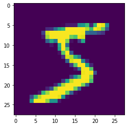
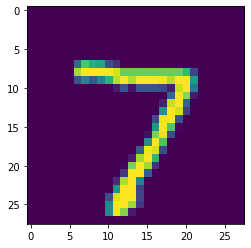

# Implementation with Tensorflow

TensorFlow is an open-source software library for dataflow programming across a range of tasks. It is a symbolic math library, and is also used for machine learning applications such as neural networks.

Unlike `sklearn.neural_network`, tensorflow give us more freedom to set up our neural-network.

The following implementation was taken directly from https://www.tensorflow.org/tutorials/keras/basic_classification

First of all, let's try to import tensorflow and keras (which is now also part of tensorflow)

## Importing Tensorflow and Keras


```python
# TensorFlow and tf.keras
import tensorflow as tf
from tensorflow import keras

# Helper libraries
import numpy as np
import matplotlib.pyplot as plt
```

## Explore the dataset

We will try to perform classification task on mnist's fashion dataset (https://www.kaggle.com/zalando-research/fashionmnist). The dataset contains of `70000` gray-scale images. Each image has `28 x 28` dimension and belong to one (and only one) of the following 10 classes:


```python
class_names = ['T-shirt/top', 'Trouser', 'Pullover', 'Dress', 'Coat',
               'Sandal', 'Shirt', 'Sneaker', 'Bag', 'Ankle boot']
```

Now, let's download `fashion_mnist` dataset from `keras.datasets` and split them into `train` and `test` set. By default, the dataset contains of `60000` training set and `10000` test set.


```python
fashion_mnist = keras.datasets.fashion_mnist

(train_images, train_labels), (test_images, test_labels) = fashion_mnist.load_data()

```

Let's explore the data a little bit

Here is a bit information about our `train_labels`. It is a one-dimension array with 60000 elements


```python
train_labels
```


    array([9, 0, 0, ..., 3, 0, 5], dtype=uint8)


```python
train_labels.shape
```


    (60000,)


Now, let's explore our `train_images`


```python
train_images
```


    array([[[0, 0, 0, ..., 0, 0, 0],
            [0, 0, 0, ..., 0, 0, 0],
            [0, 0, 0, ..., 0, 0, 0],
            ...,
            [0, 0, 0, ..., 0, 0, 0],
            [0, 0, 0, ..., 0, 0, 0],
            [0, 0, 0, ..., 0, 0, 0]],
    
           [[0, 0, 0, ..., 0, 0, 0],
            [0, 0, 0, ..., 0, 0, 0],
            [0, 0, 0, ..., 0, 0, 0],
            ...,
            [0, 0, 0, ..., 0, 0, 0],
            [0, 0, 0, ..., 0, 0, 0],
            [0, 0, 0, ..., 0, 0, 0]],
    
           [[0, 0, 0, ..., 0, 0, 0],
            [0, 0, 0, ..., 0, 0, 0],
            [0, 0, 0, ..., 0, 0, 0],
            ...,
            [0, 0, 0, ..., 0, 0, 0],
            [0, 0, 0, ..., 0, 0, 0],
            [0, 0, 0, ..., 0, 0, 0]],
    
           ...,
    
           [[0, 0, 0, ..., 0, 0, 0],
            [0, 0, 0, ..., 0, 0, 0],
            [0, 0, 0, ..., 0, 0, 0],
            ...,
            [0, 0, 0, ..., 0, 0, 0],
            [0, 0, 0, ..., 0, 0, 0],
            [0, 0, 0, ..., 0, 0, 0]],
    
           [[0, 0, 0, ..., 0, 0, 0],
            [0, 0, 0, ..., 0, 0, 0],
            [0, 0, 0, ..., 0, 0, 0],
            ...,
            [0, 0, 0, ..., 0, 0, 0],
            [0, 0, 0, ..., 0, 0, 0],
            [0, 0, 0, ..., 0, 0, 0]],
    
           [[0, 0, 0, ..., 0, 0, 0],
            [0, 0, 0, ..., 0, 0, 0],
            [0, 0, 0, ..., 0, 0, 0],
            ...,
            [0, 0, 0, ..., 0, 0, 0],
            [0, 0, 0, ..., 0, 0, 0],
            [0, 0, 0, ..., 0, 0, 0]]], dtype=uint8)


```python
train_images.shape
```


    (60000, 28, 28)


Just to make sure, let's see our first image and label in detail


```python
index = 0
label = train_labels[index]
image = train_images[index]

print("label: ", label) # this is the first train_labels
print("which is: ", class_names[label]) # use our pre-defined class_names to get textual representation of the label
plt.figure()
plt.imshow(image) # if you just want to see the matrix representation of the image, use `image` instead
plt.show()

```

    label:  9
    which is:  Ankle boot





## Configuring the neural network model

Finally, let's build our neural network.

First of all, we define 3 layers here:
* __flatten layer with input_shape = 28x28__. This one will transform our 2 dimensional matrix into 1 dimensional matrix (or a vector). The output of this layer will be an array with 784 elements
* __dense layer containing 128 neuron with relu activation__. This one will create a layer containing 128 neuron. Each of them is connected to the output of our previous layer (an array containing 784 elements). Each neuron activation is depending on `relu` function (https://en.wikipedia.org/wiki/Rectifier_(neural_networks)
* __dense layer containing 10 neuron with softmax activation__. Finally, since we have 10 classes, it is natural to have 10 neuron in our output layer. Each neuron should show us how probable is an image belong to a particular class. Finally, we will use softmax to return the prediction result (https://en.wikipedia.org/wiki/Softmax_function)

After defining the layers, we need to define our optimizer, loss function, and metrics:
* __optimizer__. How to optimize
* __loss function__. How to calculate error
* __metrics__. How to measure the quality of the network


```python
model = keras.Sequential([
    keras.layers.Flatten(input_shape=(28, 28)),
    keras.layers.Dense(128, activation=tf.nn.relu),
    keras.layers.Dense(10, activation=tf.nn.softmax)
])
model.compile(optimizer='adam',
              loss='sparse_categorical_crossentropy',
              metrics=['accuracy'])


```

## Train the neural network model


```python
model.fit(train_images, train_labels, epochs=5)
test_loss, test_acc = model.evaluate(test_images, test_labels)
print('Test accuracy:', test_acc)
```

    Train on 60000 samples
    Epoch 1/5
    60000/60000 [==============================] - 5s 89us/sample - loss: 14.5060 - accuracy: 0.1000
    Epoch 2/5
    60000/60000 [==============================] - 5s 90us/sample - loss: 14.5060 - accuracy: 0.1000
    Epoch 3/5
    60000/60000 [==============================] - 5s 90us/sample - loss: 14.5060 - accuracy: 0.1000
    Epoch 4/5
    60000/60000 [==============================] - 5s 91us/sample - loss: 14.5060 - accuracy: 0.1000
    Epoch 5/5
    60000/60000 [==============================] - 6s 93us/sample - loss: 14.5060 - accuracy: 0.1000
    10000/10000 [==============================] - 0s 42us/sample - loss: 14.5063 - accuracy: 0.1000
    Test accuracy: 0.1


## Prediction


```python
predictions = model.predict(test_images)
np.argmax(predictions[0])

index = 0
prediction_label = np.argmax(predictions[0])
target_label = test_labels[index]
image = test_images[index]

print("target label: ", target_label, class_names[target_label])
print("prediction label: ", prediction_label, class_names[prediction_label])
plt.figure()
plt.imshow(image) # if you just want to see the matrix representation of the image, use `image` instead
plt.show()

```

    target label:  9 Ankle boot
    prediction label:  3 Dress




