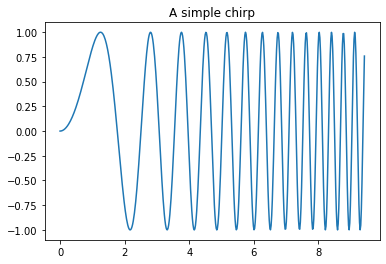

---
title: "Hello world"
date: 2019-07-31T07:48:41+07:00
categories:
- Hello world
tags:
- Hello world
---


First of all, let's try some latex: $\frac{4}{5}$

Now, I will try to use Python.
Let's start with simple hello world


```python
print("hello world")
```

    hello world


Finally, try some matplotlib thing


```python
import matplotlib.pyplot as plt
import numpy as np
%matplotlib inline

x = np.linspace(0, 3*np.pi, 500)
plt.plot(x, np.sin(x**2))
plt.title('A simple chirp')
plt.show()

```





```python

```
